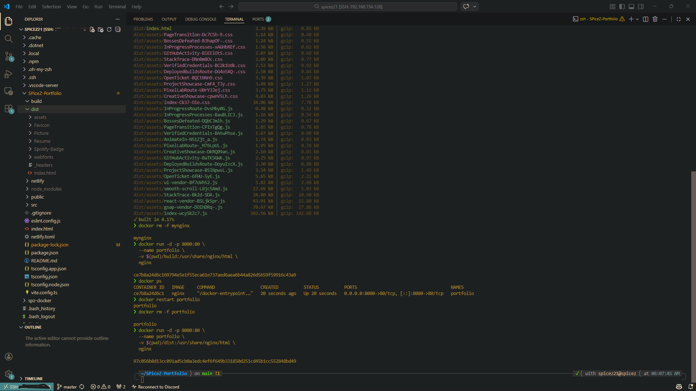
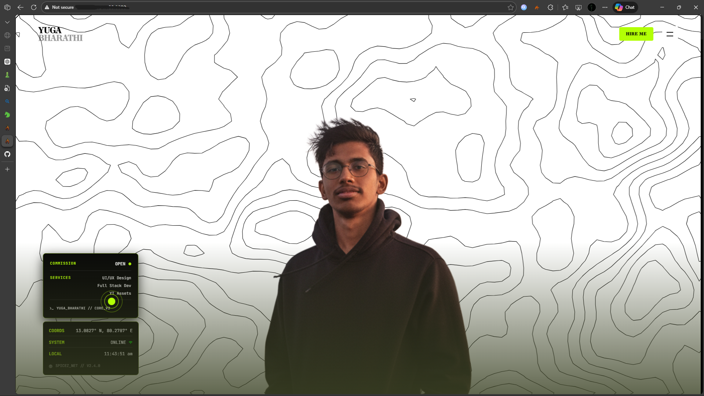
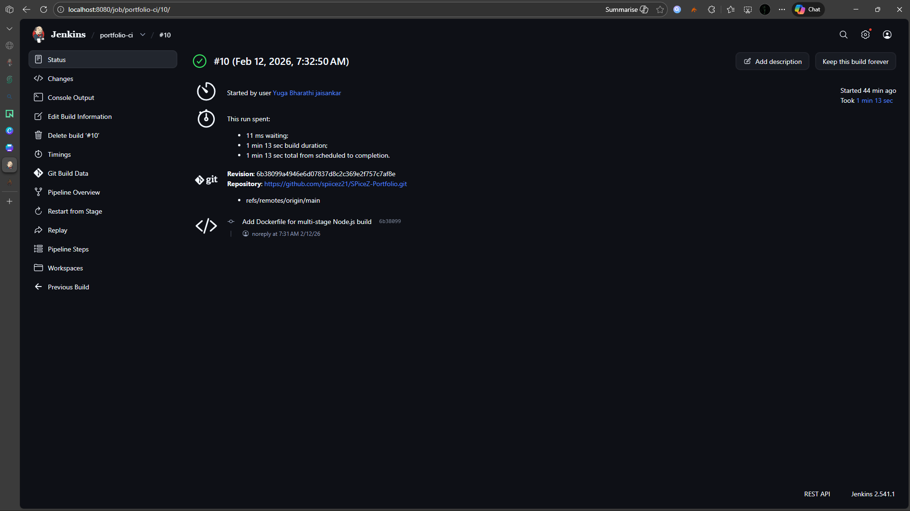

# Ubuntu DevOps Setup and CI/CD Documentation

This document describes the step by step setup of a development and deployment environment on Ubuntu, including SSH setup, Docker, Node.js, Nginx, Jenkins, Git configuration, and a working Jenkins CI/CD pipeline.

---

## 1. System Update

Update package lists and upgrade installed packages.

```bash
sudo apt update
sudo apt upgrade -y
```

---

## 2. SSH Setup

Install and enable SSH server.

```bash
sudo apt install openssh-server -y
sudo systemctl enable ssh
sudo systemctl start ssh
```

Allow SSH through firewall:

```bash
sudo ufw allow ssh
```

Verify connectivity:

```bash
ip a
ping google.com
```

---

## 3. Git Configuration

### Install Git

```bash
sudo apt install git openssh-client -y
git --version
```

### Configure Git Identity

```bash
git config --global user.name "spiicez21"
git config --global user.email "yuga.bharathijai2106@gmail.com"
git config --list
```

### Generate SSH Key

```bash
ssh-keygen -t ed25519 -C "yuga.bharathijai2106@gmail.com"
eval "$(ssh-agent -s)"
ssh-add ~/.ssh/id_ed25519
cat ~/.ssh/id_ed25519.pub
```

Add the public key to GitHub and verify:

```bash
ssh -T git@github.com
```

---

## 4. Docker Installation

### Install Dependencies

```bash
sudo apt install -y ca-certificates curl gnupg
sudo install -m 0755 -d /etc/apt/keyrings
```

### Add Docker Repository

```bash
curl -fsSL https://download.docker.com/linux/ubuntu/gpg | \
sudo gpg --dearmor -o /etc/apt/keyrings/docker.gpg

echo "deb [arch=$(dpkg --print-architecture) signed-by=/etc/apt/keyrings/docker.gpg] \
https://download.docker.com/linux/ubuntu \
$(. /etc/os-release && echo $VERSION_CODENAME) stable" | \
sudo tee /etc/apt/sources.list.d/docker.list > /dev/null
```

### Install Docker

```bash
sudo apt update
sudo apt install -y docker-ce docker-ce-cli containerd.io docker-buildx-plugin docker-compose-plugin
```

### Verify Docker

```bash
sudo docker run hello-world
sudo usermod -aG docker $USER
newgrp docker
docker run hello-world
```

---

## 5. Node.js Installation

```bash
curl -fsSL https://deb.nodesource.com/setup_lts.x | sudo -E bash -
sudo apt install -y nodejs
sudo apt install -y build-essential
node -v
npm -v
```

---

## 6. Nginx Installation

```bash
sudo apt install -y nginx
sudo systemctl start nginx
sudo systemctl enable nginx
sudo systemctl status nginx
```

Allow firewall:

```bash
sudo ufw allow 'Nginx Full'
sudo ufw enable
```

---

## 7. Build and Deploy Portfolio with Docker

### Clone Repository

```bash
git clone https://github.com/spiicez21/SPiceZ-Portfolio.git
cd SPiceZ-Portfolio
npm install
```

### Build Application

```bash
npm run build
```

### Deploy via Docker

```bash
docker rm -f portfolio

docker run -d -p 8080:80 \
  --name portfolio \
  -v $(pwd)/dist:/usr/share/nginx/html \
  nginx
```

Restart container:

```bash
docker restart portfolio
```





---

## 8. Jenkins Installation

### Install Java

```bash
sudo apt install openjdk-17-jdk -y
java -version
```

### Add Jenkins Repository

```bash
curl -fsSL https://pkg.jenkins.io/debian-stable/jenkins.io-2023.key | \
sudo tee /usr/share/keyrings/jenkins-keyring.asc > /dev/null

echo "deb [signed-by=/usr/share/keyrings/jenkins-keyring.asc] \
https://pkg.jenkins.io/debian-stable binary/" | \
sudo tee /etc/apt/sources.list.d/jenkins.list > /dev/null
```

### Install Jenkins

```bash
sudo apt update
sudo apt install jenkins -y
sudo systemctl enable jenkins
sudo systemctl start jenkins
sudo systemctl status jenkins
```

### Get Initial Admin Password

```bash
sudo cat /var/lib/jenkins/secrets/initialAdminPassword
```

---

## 9. Jenkins Docker Permissions

Allow Jenkins to use Docker:

```bash
sudo usermod -aG docker jenkins
sudo systemctl restart jenkins
```

---

## 10. Jenkins CI/CD Pipeline Execution

The Jenkins pipeline performs:

1. Clean workspace
2. Clone GitHub repository
3. Verify Node and npm
4. Install dependencies
5. Build production bundle
6. Build Docker image
7. Deploy container

### Repository

```
https://github.com/spiicez21/SPiceZ-Portfolio.git
```

### Node Environment

```
Node v24.13.1
npm 11.8.0
```

### Build Output

* Production build completed successfully
* Assets generated under `dist/`
* No build errors
* 2 npm vulnerabilities reported (non-blocking)

### Docker Build

* Multi-stage Docker build
* Node Alpine builder stage
* Nginx Alpine runtime stage
* Image name: `portfolio-image`

### Container Deployment

```bash
docker rm -f portfolio-container
docker run -d -p 3000:80 --name portfolio-container portfolio-image
```

Access application:

```
http://server-ip:3000
```

### Pipeline Result

```
Finished: SUCCESS
```

Deployment completed successfully.





